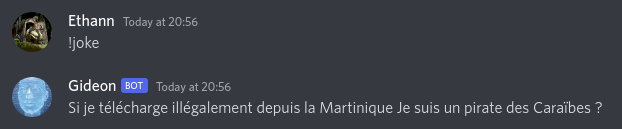
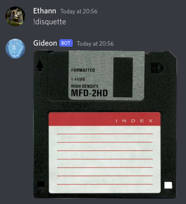

# Gideon
Gideon is a discord Bot for personnal use
He can play music (with youtube)
tell you joke and my other thing
!help ;)

## Table of Contents

- [Gideon](#gideon)
	- [Table of Contents](#table-of-contents)
	- [Link](#link)
	- [Commands](#commands)
		- [!help](#help)
		- [!salut](#salut)
		- [!pileFace](#pileface)
		- [!play](#play)
		- [!skip](#skip)
		- [!stop](#stop)
		- [!pi](#pi)
		- [!joke](#joke)
		- [!sel](#sel)
		- [!disquette](#disquette)

  - [Version](#version)
    - [Date](#date)

## Link
https://discord.com/oauth2/authorize?client_id=677983998504468523&scope=bot&permissions=9
To made Gideon join your discord

## Commands
### !help
Simple Help page

### !salut
Say hello

### !pileFace
Simple Pile Ou Face (heads or tails)

### !play
play Music

### !skip
skip Music

### !stop
stop Music

### !pi
tell you pi Number

### !joke
tell you a joke

### !sel
Give you salt picture

### !disquette
Give you disquette

## Version
2.4.3
### Date
10 May 2022
